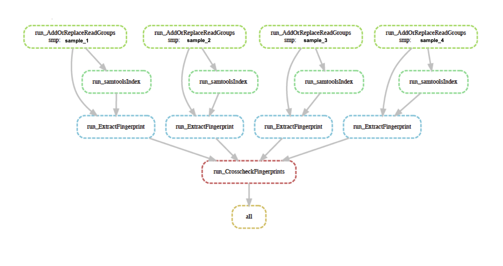

# crosscheck_fingerprints_snakemake 
Pipeline for scaling crosscheck fingerprints for datasets with multiple rna-seq samples per patient. 

**This is a work in progress.** 

[Crosscheck fingerprints](https://gatk.broadinstitute.org/hc/en-us/articles/360037594711-CrosscheckFingerprints-Picard-) indicates whether two RNA-seq samples come from the same individual.
This snakemake pipeline includes the steps necessary to run CrosscheckFingerprints in parallel, as demonstrated in this dag:


Why snakemake? 
- Parallelization of independent jobs (i.e. adding read groups and extracting fingerprints) 
- Snakemake is aware of which jobs have been run (read: if job output exists in the correct location) and will only run jobs that haven't been run before (read: don't have existing output in the correct location). For this project, we don't have all of our rna samples sequenced yet. In this case, we will be able to add bam files as samples are sequenced and rerun the snakemake pipeline. Snakemake will only do the jobs in the Snakefile (add read groups and extract fingerprints) for the new files without modifying our code. Same will be true for comparisons later... 

Help getting started with snakemake [here](https://github.com/Snitkin-Lab-Umich/Snakemake_setup).

### To run this pipeline you will need to: 
### 1. Activate conda environment
Make and activate the conda environment from the [gatk4_sn.yml](https://github.com/shoffm/crosscheck_fingerprints_pipeline/blob/main/gatk4_sn.yml). Help getting started with conda [here](https://github.com/Snitkin-Lab-Umich/Snakemake_setup#conda).
```
conda env create -f gatk4_sn # do this only once, the first time
conda activate gatk4_sn # do this every time
```
### 2. Edit Snakefile
In the Snakefile there are four steps 
1. `AddOrReplaceReadGroups` You'll need a directory of .bam input files
2. `samtools index` to index the new bams with readgroups
3. `ExtractFingerprints` You'll need two files
  - Reference sequence used to assemble your genomes (i.e. `Homo_sapiens.GRCh38.dna.primary_assembly.fa`) 
  - [Haplotype map](https://gatk.broadinstitute.org/hc/en-us/articles/360035531672-Haplotype-map-format). Can be downloaded from [github](https://github.com/naumanjaved/fingerprint_maps). **Note:** The header to this file must match the header of your bam files (copy the header of your file and replace the header to the haplotype map file if need be).
4. `CrosscheckFingerprints` to crosscheck all of the fingerprints we've generated. This compares each fingerprint to all others. Originally we wanted to compare only samples that came from the same individual, but the heavy lifting is generating the fingerprints and crosschecking them isn't too bad, so we will leave it at this. If you want to only check samples that come from the same individual, see this [example script](https://github.com/shoffm/crosscheck_fingerprints_pipeline/blob/main/generate_sample_pairs.R) for how to generate sample pairs. 

**Edit** the [Snakefile](https://github.com/shoffm/crosscheck_fingerprints_pipeline/blob/main/Snakefile) to point to the directory with your bam files, reference sequence, haplotype map and desired output directories. 

Do a dry run to determine if snakemake can make sense of your input and output paths in the workflow.
```
snakemake -n
```

### 3. Submit snakemake job 
Submission bash script can be found here [submit_snakemake.sh](https://github.com/shoffm/crosscheck_fingerprints_snakemake/blob/main/submit_snakemake.sh).

Remember to have activated your conda environment from step 1. 
```
bsub < submit_snakemake.sh
```

